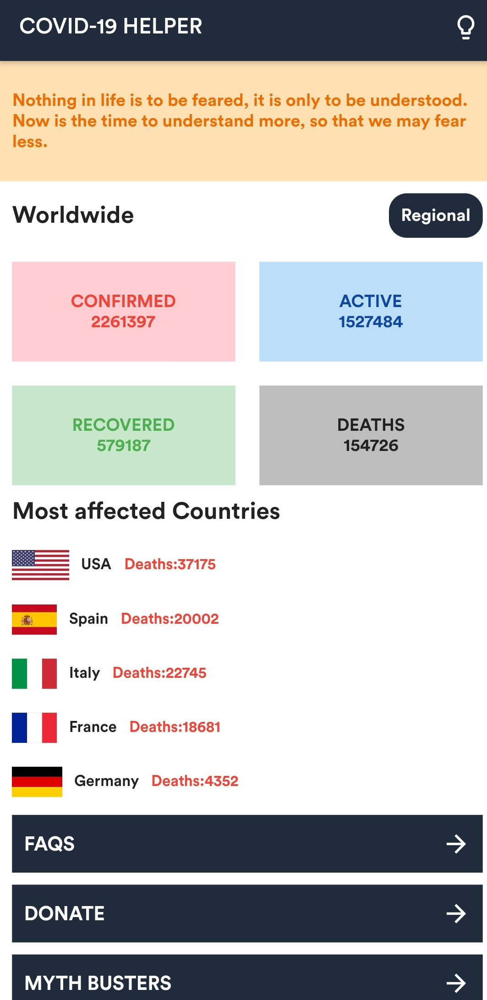

# CV-19 Helper

[](https://cvbot-19.herokuapp.com/)

CV-19 Helper is a flutter app and a flask chatbot which work together in BUSTING myths and Fake news.
  - The Chatbot is a flask app working on chatter bot
  - The app is based on covid 19 info tracker api
  - The app has DArk mode too.


```sh
$ flutter get
to get packeges
$ flutter run
To run the app in emulator
```

### TECH USED 
```sh
 flutter 
 Python
 Flask
```


### SOCIAL LINKS

|  |  |
| ------ | ------ |
| GitHub | https://github.com/duengeonmasterr|
| Linked in | https://www.linkedin.com/in/harshit-sachdeva-6346ba134/|
| Resume | https://drive.google.com/file/d/1V5d5ghPpmPrWrQMIG-5O9p8rAqEl-LgJ/view?usp=sharing |
| play store | https://play.google.com/store/apps/developer?id=VRGr8+developers |
| Blog |https://techmasterr777.blogspot.in/ |

   


   
